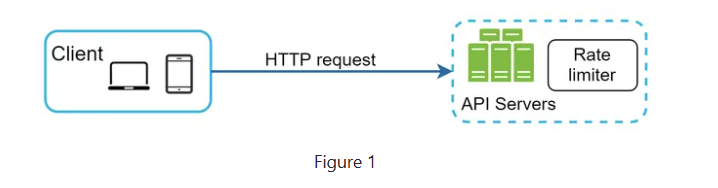
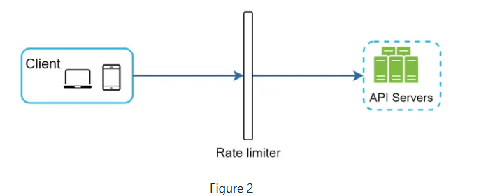
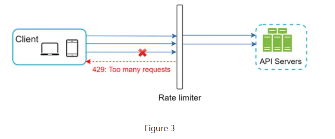

# Rate Limiter
A rate limiter is a mechanism used to control the rate of requests or actions in a system. It helps prevent abuse, ensures fair usage, and maintains system stability by limiting the number of requests that can be processed within a specified time frame.
## Types of Rate Limiting Algorithms
1. **Fixed Window**: Limits the number of requests in a fixed time window (e.g., 100 requests per minute). Simple but can lead to burstiness at the edges of the window.
2. **Sliding Window**: Similar to fixed window but uses a rolling time window, providing a smoother rate limiting experience.
3. **Leaky Bucket**: Requests are added to a queue and processed at a constant rate. Excess requests are dropped if the queue is full.
4. **Token Bucket**: Tokens are added to a bucket at a fixed rate. Each request consumes a token. If no tokens are available, the request is denied. Allows for bursts of traffic.

## Requirements:
- Accurately limit excessive requests.
- Low latency. The rate limiter should not slow down HTTP response time.
- Use as little memory as possible.
- Distributed rate limiting. The rate limiter can be shared across multiple servers or processes.
- Exception handling. Show clear exceptions to users when their requests are throttled.
- High fault tolerance. If there are any problems with the rate limiter (for example, a cache server goes offline), it does not affect the entire system.

- Figure 1 shows a Rate limiter that is placed on the server-side.
---

- Besides the client and server-side implementations, there is an alternative way. Instead of putting a rate limiter at the API servers, we create a rate limiter middleware, which throttles requests to your APIs as shown in Figure 2.
---

- Let us use an example in Figure 3 to illustrate how rate limiting works in this design. Assume our API allows 2 requests per second, and a client sends 3 requests to the server within a second. The first two requests are routed to API servers. However, the rate limiter middleware throttles the third request and returns a HTTP status code 429. The HTTP 429 response status code indicates a user has sent too many requests.
---

### Source: https://bytebytego.com/courses/system-design-interview/design-a-rate-limiter
### Design: https://www.youtube.com/watch?v=SgWb6tWx3S8