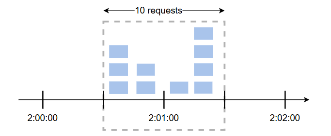

## Fixed Sized Window Rate Limiter:
- A Fixed Sized Window Rate Limiter is a simple algorithm used to control the rate of requests in a system. 
- It divides time into fixed-size intervals (windows) and allows a certain number of requests within each window. 
- If the number of requests exceeds the limit for that window, further requests are denied until the next window begins.

### Overview:
- Let us use a concrete example to see how it works. 
- In Figure 8, the time unit is 1 second and the system allows a maximum of 3 requests per second. 
- In each second window, if more than 3 requests are received, extra requests are dropped as shown in Figure 8.

---

### Major Problem:
- The major problem with the fixed window algorithm is that it can lead to bursts of traffic at the edges of the windows.
