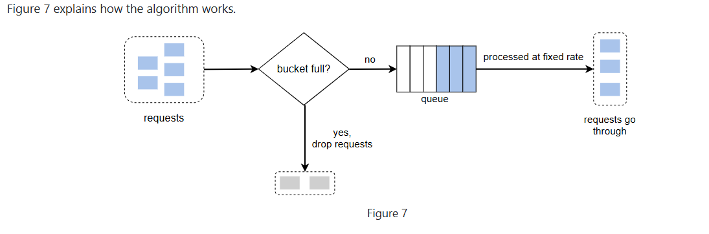

## Leaky Bucket

### Overview
- The leaking bucket algorithm is similar to the token bucket except that requests are processed at a fixed rate. 
  - It is usually implemented with a first-in-first-out (FIFO) queue. The algorithm works as follows:
  - When a request arrives, the system checks if the queue is full. If it is not full, the request is added to the queue.- - Otherwise, the request is dropped.
  - Requests are pulled from the queue and processed at regular intervals.

---
### Parameters:
- Bucket size: it is equal to the queue size. The queue holds the requests to be processed at a fixed rate.
- Outflow rate: it defines how many requests can be processed at a fixed rate, usually in seconds.
---

### Pros:
- Memory efficient given the limited queue size.
- Requests are processed at a fixed rate therefore it is suitable for use cases that a stable outflow rate is needed.